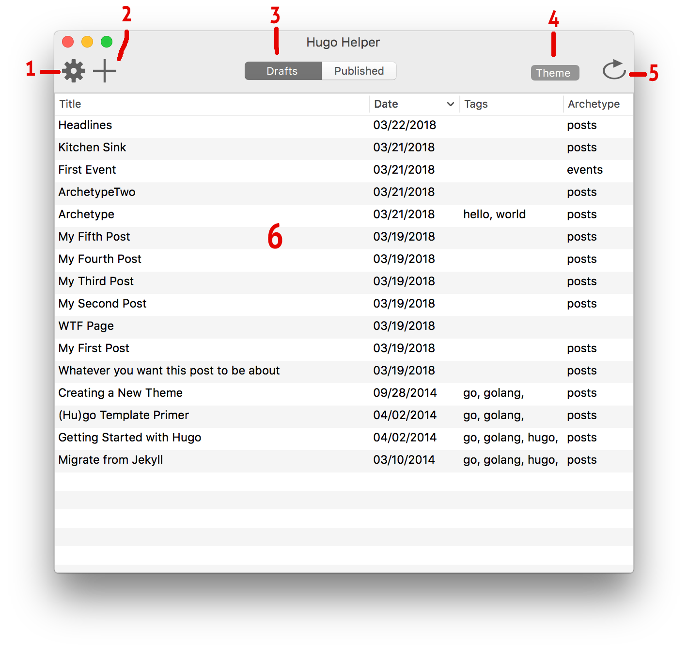
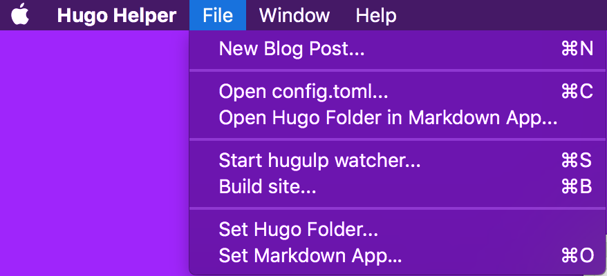
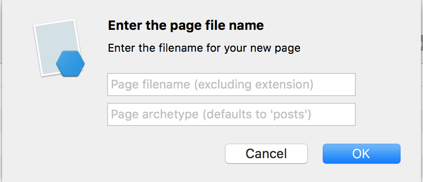
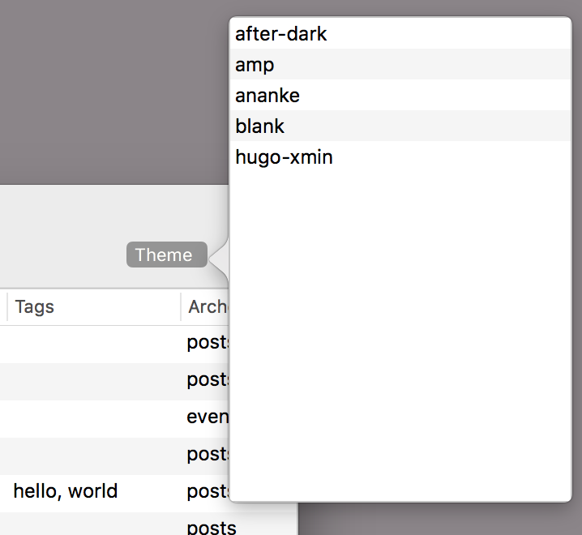

# Hugo Helper
macOS app for managing a Hugo website

The code in this app is not beautiful or optimal! It was quickly thrown together to make a useable frontend for a Hugo website. It also has some helpers if you are using the excellent Hugo asset optimizer [Hugulp](https://github.com/jbrodriguez/hugulp). You can ignore them if you are some kind of crazed lunatic not using Hugulp.

## Setup
Compile the app with Xamarin or Visual Studio Mac (**not** VS Code!). It will be in the bin folder waiting for you. Launch the app and there are two bits of setup required:
1. Choose `File -> Set Hugo Folder` and pick the root folder of your Hugo website
2. Choose `File -> Set Markdown App` and pick a Markdown app to edit files with. [VS Code](https://code.visualstudio.com/) and [MacDown](https://macdown.uranusjr.com/) are two excellent apps.

## The Interface
The main window where you will spend most of your time in Hugo Helper. Numbered points are explained below.

1. **Start/Stop server button:** Press this and a new tab will be opened up in your browser with the local Hugo server url. Press it again to stop the server.
2. **Create New Post button:** Press the button (or use the `File -> New Blog Post` menu item) and you'll get the new file dialog (see below for details).
3. **Drafts/Published Toggle:** Choose which files Hugo Helper will display.
4. **Theme Picker:** Click this for a list of all your installed themes. Clicking a theme will change your `config.toml` file and restart the Hugo server. See below for info.
5. **Refresh Button:** Click to refresh all the blog posts. You only really need this if you add/remove files in Finder.
6. **Blog Post List:** Click any row to open the post in the Markdow editor that you selected in the *Setup* section. The *archetype* column is for sites that use more than one type for posts. It will pull it from the path. For example, if you have `content/posts` and `content/events` the archetypes will be *posts* and *events*.

## The Menu

Generally, once you setup your Hugo folder and Markdown app you wont need the menu unless you are doing some layout work or using Hugulp. When working with Hugulp `scss` files use the `File -> Start hugulp watcher` menu item to launch Terminal and get Hugulp watching your Hugulp folder for changes. The one downside here is if Hugulp gets an error while transpiling your scss files it poops itself and you need to restart it in Terminal. Just press `up` and then `return`. The `File -> Build site` button will do a Hugo build and then a Hugulp build.

If you want to take a peek at the Hugo server logs use the `Window -> Show Server Logs` menu item. It will open a new window with the logs that are updated in real time. Useful for when you are tinkering with your templates and you get compile errors.

## Creating New Files

Not much to say here. Enter a filename (sans extension) and optionally an archetype. The archetype will decide which subfolder of your `content` folder the new files is created in.

## Theme Picker

Any themes in your *themes* folder will show up here. Click a theme and the Hugo server will be restarted after setting the theme in your `config.toml` file.
